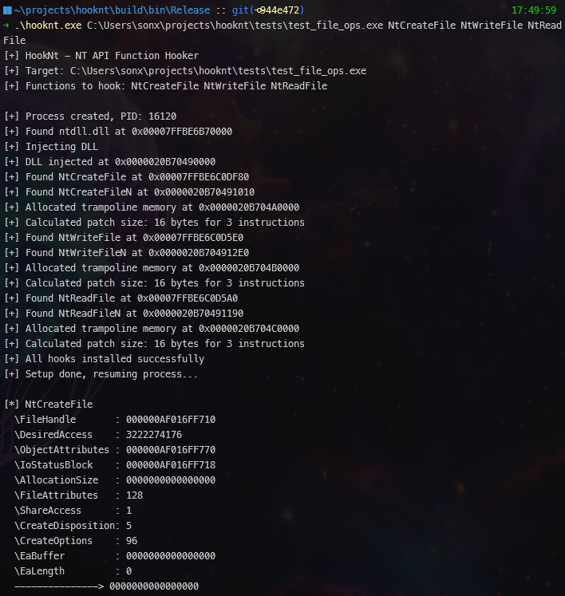

<div align="center">

<h1 align="center" style="font-family: 'Segoe UI', sans-serif; font-size: 60px;">
  HookNt
</h1>


A Windows NT API hooking tool for intercepting and monitoring system calls

</div>

## Overview

HookNt is a powerful tool for intercepting and monitoring Windows NT API calls. It uses a combination of DLL injection and function hooking techniques to provide visibility into low-level system operations.

## How It Works


## Components

### ntdllN.dll
- Provides hooked versions of NT functions
- Logs parameters and return values
- Uses trampoline-based hooking
- Maintains original function behavior

### hookNt.exe
- Creates target process
- Injects ntdllN.dll
- Patches NT functions
- Manages trampoline memory

## Usage

1. **Build the Project**:
  Build the project using Visual Studio

2. **Run the Application**:
  ```bash
  hookNt.exe <target_program> <nt_function1> <nt_function2> ...
  ```

## Extending NT Functions

The project comes with a few predefined NT functions (`NtCreateFile`, `NtReadFile`, `NtWriteFile`), but you can easily add more:

1. Add the function declaration in `ntdllN.h`:
  ```cpp
  extern "C" __declspec(dllexport) NTSTATUS NtNewFunctionN(/* parameters */);
  ```

2. Add the trampoline variable in `ntdllN.cpp`:
  ```cpp
  extern "C" __declspec(dllexport) PVOID NtNewFunctionTrampoline = nullptr;
  ```

3. Implement the hooked function in `ntdllN.cpp`:
  ```cpp
  extern "C" __declspec(dllexport) NTSTATUS NtNewFunctionN(/* parameters */) {
      Logger::printfN("\n[*] NtNewFunction\n");
      // Log parameters
      // Call original via trampoline
      // Log result
      return result;
  }
  ```

## Example

```bash
hookNt.exe test.exe NtWriteFile NtCreateFile NtReadFile
```




Output will show:
- Process creation and injection status
- Function hooking details
- Parameters and return values of hooked functions

## Limitations
- Currently only supports x64 architecture
- Target process must have a console window/terminal

## License

This project is licensed under the MIT License. See the [LICENSE](LICENSE) file for more details.

## Disclaimer

This project is for educational purposes only. Use it responsibly and ensure you have permission to hook into any target processes.
