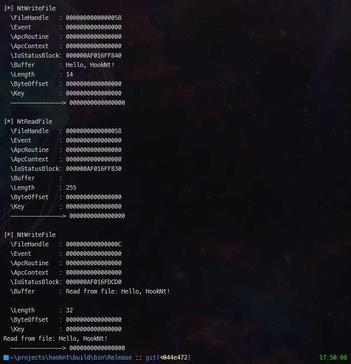

# HookNt

A Windows NT API hooking framework that allows monitoring and intercepting NT system calls in target processes. Built with C++ and CMake.

## Overview

HookNt enables you to intercept and monitor NT system calls by hooking functions in the Windows NT API. The framework uses a function-based architecture with separation of concerns.

## Features

- Process creation and DLL injection
- NT function hooking with trampoline support
- Parameter logging for hooked functions
- CMake-based build system
- Support for multiple NT functions

## Project Structure

```
srcn/
├── CMakeLists.txt                 # Main CMake configuration
├── build.bat                      # Windows build script
├── src/
│   ├── include/                   # Public headers
│   │   ├── common.h               # Shared definitions and types
│   │   ├── hook_manager.h         # Hook management interface
│   │   ├── process_manager.h      # Process management interface
│   │   ├── memory_utils.h         # Memory utility functions
│   │   ├── ntdlln.h               # DLL exports and NT function declarations
│   │   ├── module_resolver.h      # Module resolution interface
│   │   ├── function_resolver.h    # Function resolution interface
│   │   └── logger.h               # Logging interface
│   ├── hooknt/                    # Main executable
│   │   ├── main.cpp               # Application entry point
│   │   ├── process_manager.cpp
│   │   ├── hook_manager.cpp
│   │   └── memory_utils.cpp
│   └── ntdlln/                    # Hook DLL
│       ├── dllmain.cpp            # DLL entry point
│       ├── ntdlln.cpp             # NT function hooks
│       ├── module_resolver.cpp
│       ├── function_resolver.cpp
│       └── logger.cpp
└── libs/distorm/                  # DiStorm integration
```

## Building

```cmd
cd srcn
.\build.bat
```

This will generate:
- `hooknt.exe` - Main executable
- `ntdlln.dll` - Hook DLL

## Usage

```cmd
  hookNt.exe <target_program> <nt_function1> <nt_function2> ...
```

Example:

```cmd
   # Hook file operations in the test.exe process
   hookNt.exe test.exe NtWriteFile NtCreateFile NtReadFile
```




Output will show:
- Process creation and injection status
- Function hooking details
- Parameters and return values of hooked functions

## How It Works

1. **Process Creation**: Creates target process suspended
2. **DLL Injection**: Uses reflective DLL injection
3. **Function Resolution**: Locates NT functions in both DLLs
4. **Trampoline Creation**: Preserves original functionality
5. **Function Patching**: Redirects calls to hooks
6. **Process Resumption**: Resumes with hooks active

### Sequence Diagram


## Architecture

### Core Components

- **Process Manager**: Handles process creation, DLL injection, and memory management
- **Hook Manager**: Manages function hooking, patching, and trampoline creation
- **Memory Utils**: Provides custom memory functions
- **Module Resolver**: Implements PEB-based module resolution
- **Function Resolver**: Handles export table parsing
- **Logger**: Provides logging functionality

## Technical Details

- **Architecture**: x64 Windows
- **Jump Technique**: push+ret for 64-bit absolute jumps
- **String Operations**: Custom implementations
- **Calling Convention**: NTAPI for all NT functions
- **Memory Safety**: Proper allocation/cleanup
- **Build System**: CMake

## Adding New Functions

Currently, only the following functions are supported:
- `NtCreateFile`
- `NtReadFile`
- `NtWriteFile`

But you can easily add new functions by following these steps:

1. **Add trampoline variable:**
   ```cpp
   extern "C" __declspec(dllexport) PVOID NtNewFunctionTrampoline = nullptr;
   ```

2. **Implement hook:**
   ```cpp
   extern "C" __declspec(dllexport) NTSTATUS NTAPI NtNewFunctionN(...) {
       printfN("\n[*] NtNewFunction\n");
       // Log parameters
       
       typedef NTSTATUS(NTAPI* NtNewFunction_proc)(...);
       NtNewFunction_proc trampoline = (NtNewFunction_proc)NtNewFunctionTrampoline;
       return trampoline(...);
   }
   ```

3. **Add declaration to ntdlln.h**
4. **Rebuild**

## Prerequisites

- Visual Studio 2019+ (with C++)
- CMake 3.20+
- Windows SDK

## License

Educational and research purposes. Use responsibly and in accordance with applicable laws. 